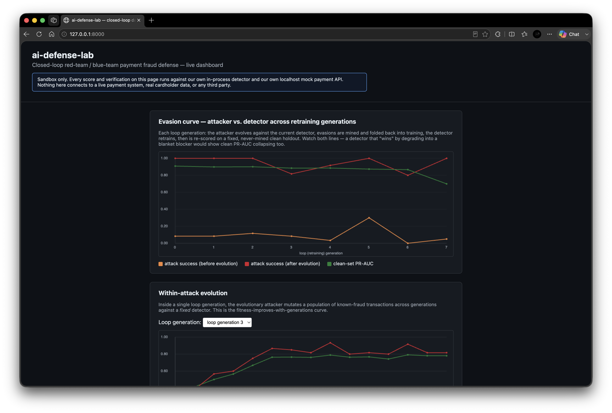
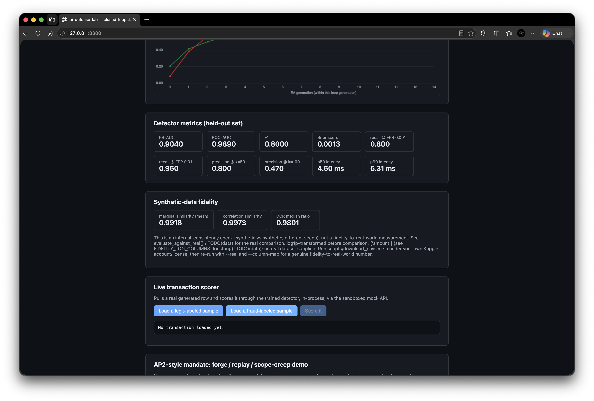
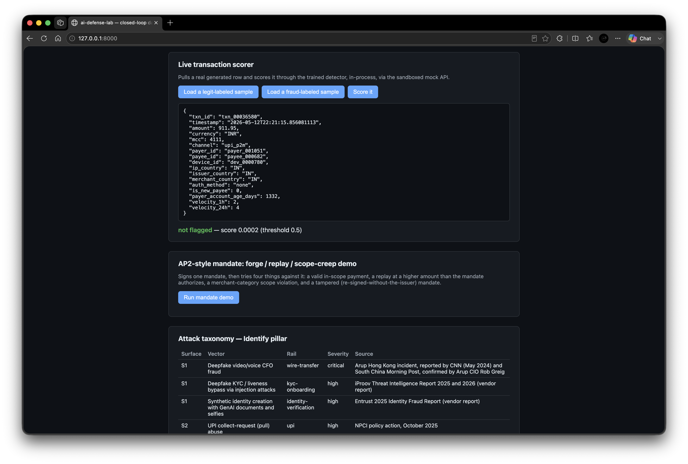
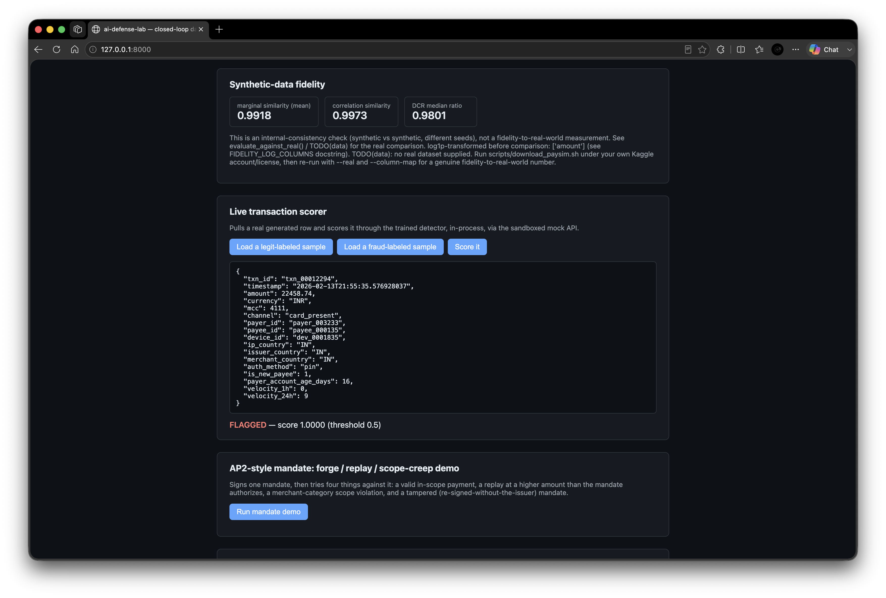
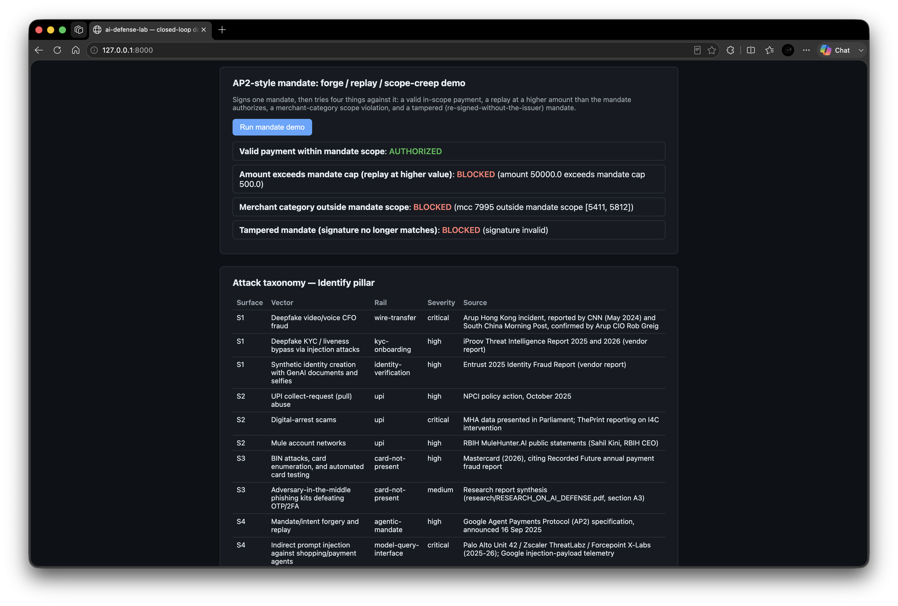
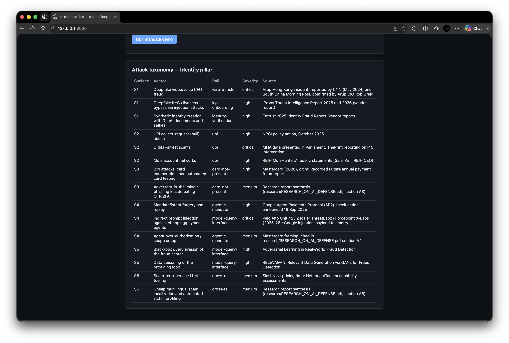

# ai-defense-lab

Closed-loop red-team / blue-team payment fraud system, built for the
Mastercard Innovation Challenge @ GFF 2026.

The loop is the product: a synthetic-transaction generator feeds a LightGBM
fraud detector; an evolutionary attacker mutates transactions against the
detector's own score until it evades; successful evasions are mined back into
the training set; the detector retrains; the cycle repeats. We track both the
attacker's success rate and the detector's clean-set PR-AUC per generation so
the detector can't "win" by degrading into a blanket blocker.

## What to check first, if you're skimming

Most of what's below is standard scaffold documentation. The parts of this
repo that are actually worth a judge's time are the parts that produce a
number nobody asked for and report it anyway:

- `results/attack_generation_curve.csv` — the within-episode evasion curve
  (8.3% → 100% by generation 6), evidence the attacker is *searching*, not
  guessing once and getting lucky.
- `results/evasion_curve.json` — eight retraining rounds where clean-set
  PR-AUC is tracked alongside attack success, specifically so a detector
  that "wins" by turning into a blanket blocker would show up as a PR-AUC
  collapse, not a victory. In this run it's not a clean win either way:
  clean PR-AUC holds in a 0.87–0.91 band for the first seven rounds, then
  drops to 0.70 at round 7, a dip we haven't root-caused and left flagged
  rather than smoothed over. Attack success stays at or near 100% almost
  every round regardless — mining evasions back into training isn't
  neutralizing the attacker, and we're reporting that instead of picking
  a rosier round to cite.
- `results/fidelity_report_vs_paysim.json` — a synthetic-vs-real fidelity
  check against 6.36M PaySim transactions that came back at 20% marginal
  similarity. We didn't retune the generator until that number looked
  better; `defend/eval/fidelity.py`'s module docstring walks through why,
  including a dead-end log-transform attempt that turned into a finding
  about Kolmogorov–Smirnov invariance.
- `identify/taxonomy.yaml` — every attack row cites a named incident,
  protocol spec, or regulator filing, not a category an LLM would invent
  unprompted (S1-02 and S6 in particular are marked with vendor-attributed
  figures, flagged as such, because they came from a party with a
  commercial incentive to inflate them).
- 17 named, interpretable schema fields (`amount`, `channel`,
  `velocity_1h`, ...) instead of PCA components, specifically so every
  attacker mutation and every detector feature is something you can point
  to and explain, not a number called `V17`.

None of that is unusual to build. What's harder to fake is running it,
finding the answer you didn't want, and printing it anyway — that's the
throughline across this repo, not any one component.

## Demo

Screenshots from the live dashboard (`make web`), each panel backed by real
results in `results/`, not mock data.

| | |
|---|---|
|  |  |
| Evasion curve across 8 retraining rounds (clean-set PR-AUC vs. attack success) plus the within-episode evolutionary curve for a single generation. | Held-out detector metrics (PR-AUC, ROC-AUC, recall@FPR, latency) and the synthetic-data fidelity check, reported as-is. |
|  |  |
| Live scorer on a legit-labeled sample — not flagged, score 0.0002. | Live scorer on a fraud-labeled sample — flagged, score 1.0000. |
|  |  |
| AP2-style mandate demo: a valid in-scope payment authorized; a replay above the mandate cap, a scope violation, and a tampered mandate all blocked. | The attack taxonomy table — every row sourced to a named incident, spec, or report. |

## Status: scaffold + vertical slice

This repo is deliberately built in passes. The current pass wires one
end-to-end path that actually runs:

```
synthetic transactions -> LightGBM detector -> evolutionary attacker
    -> evasions mined -> detector retrains -> evasion curve -> results/
```

A second pass added v1 implementations of the multimodal, graph, mock-API,
fidelity, and web layers — each real and testable, but each with an
explicit scope limit (below) rather than the full design.

| Component | This pass |
|---|---|
| `generate/synth` | Implemented — named, interpretable fields, configurable base rates |
| `generate/synth/multimodal.py` | Implemented — synthetic session-risk placeholder features (not real audio/video), see file docstring |
| `generate/attacker` | Implemented — evolutionary search over attacker-controllable fields, seeded from known-fraud rows |
| `generate/mock_api` | Implemented — `/transactions/score` (wraps `FraudDetector`), `/mandates/verify` (HMAC-signed AP2-style mandate signature/expiry/scope checks) |
| `defend/transaction` | Implemented — sklearn Pipeline, LightGBM, isotonic calibration |
| `defend/multimodal` | Implemented (v1) — `SyntheticFeatureScorer` + `LateFusionScorer` fit/score on synthetic placeholder features; a real ASVspoof/FaceForensics++-backed scorer drops in later behind the same `MultimodalScorer` interface |
| `defend/graph` | Implemented (v1) — `StructuralGraphFeaturizer`: pandas-computed fan-in/fan-out and shared-device degree counts, no GNN dependency; not yet wired into the detector's training pipeline |
| `defend/eval/metrics.py` | Implemented — PR-AUC, ROC-AUC, F1, recall@FPR, precision@k, Brier, latency |
| `defend/eval/fidelity.py` | Implemented (v1) — marginal/correlation similarity + DCR privacy check; runs today as an internal-consistency check (synthetic vs. synthetic). Fidelity-to-*real*-data numbers need PaySim downloaded under your own Kaggle account (`scripts/download_paysim.sh`) — not run in this repo, see file docstring |
| `loop/orchestrator.py` | Implemented — runs the full attack/retrain cycle |
| `web/` | Implemented — single-page dashboard (`make web`): evasion curve, within-attack curve, metrics, fidelity, live scorer, mandate demo, taxonomy table |

## Sandbox statement

All adversarial testing in this repository runs against our own in-process
detector and our own sandboxed mock payment API (`generate/mock_api`, localhost
only) — see that module's docstring. Nothing here connects to, tests against,
or is intended for use against any live payment system, real cardholder data,
or third-party infrastructure. The closed loop (`loop/orchestrator.py`) still
scores in-process, not over HTTP; the mock API is a separate demo surface.

## Data provenance

All data used or planned for use in this repo is synthetic, anonymised, or
released under a research/open license. No real cardholder data, no PII, no
production payment data — ever. The default generator (`generate/synth`)
produces fully synthetic transactions from configured base rates; it does not
read or derive from any real dataset. A `--source` flag exists to later swap
in a derived dataset (e.g. PaySim); the fetch scripts for any such dataset
live in `scripts/download_*.sh` and are run manually, under the user's own
license agreement, never automatically.

## Setup

Requires Python 3.11. If `python3.11` isn't your default `python3`, install
it first (e.g. `brew install python@3.11` on macOS).

```
make setup    # creates .venv with python3.11, installs pinned requirements
make data     # generates a synthetic transaction dataset into data/
make train    # trains and calibrates the LightGBM detector
make loop     # runs the closed-loop attacker/detector co-evolution
make eval     # writes evaluation metrics to results/
make fidelity # writes a synthetic-data fidelity report to results/
make web      # serves the dashboard at http://127.0.0.1:8000 (run loop/eval/fidelity first)
make test     # runs the pytest smoke suite
make demo     # prints pointers to make web / the mock API
make clean    # removes data/, results/ contents, and the venv
```

`make loop` run twice with the same `config/default.yaml` produces identical
numbers — the seed in `config/default.yaml` is threaded through numpy,
Python's `random`, and LightGBM.

## Configuration

All tunable parameters (seed, generator base rates, LightGBM hyperparameters,
evolutionary-attacker settings, loop generation count, metric thresholds)
live in `config/default.yaml`, loaded via `config/settings.py`
(pydantic-settings). No magic numbers in code.

## Repository layout

See `config/default.yaml` for parameters and `identify/taxonomy.yaml` for the
attack taxonomy (schema only this pass). Component-level detail is in the
table above.
